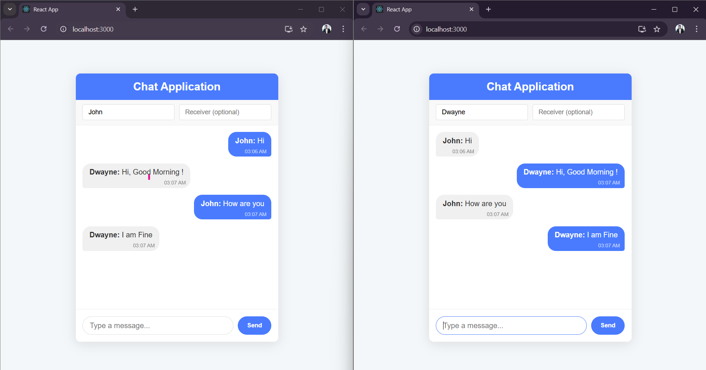
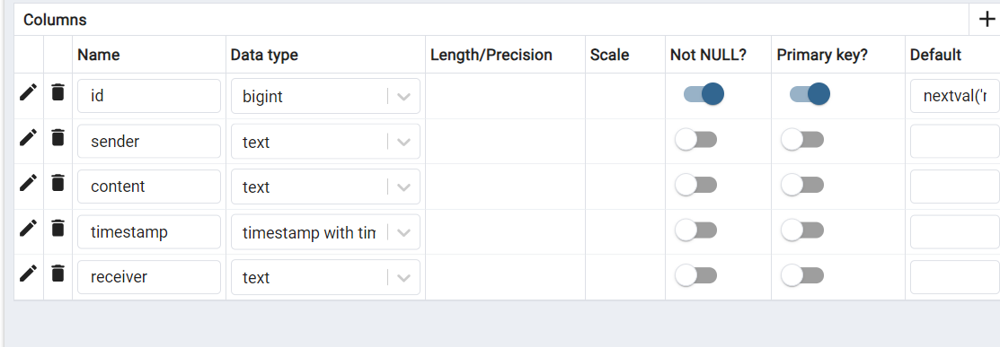
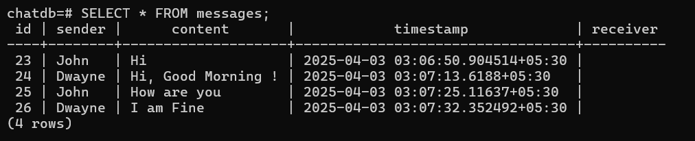

# WebSocket Chat App with Go & PostgreSQL

A modern real-time chat application built with React and Go, featuring direct messaging capabilities and message persistence using PostgreSQL.

## Features

- **Real-time Communication**: Instant messaging using WebSockets
- **User Identification**: Custom usernames for chat participants
- **Direct Messaging**: Option to send private messages to specific users
- **Message Persistence**: Chat history stored in PostgreSQL database
- **Modern UI**: Clean and responsive interface built with React

## Project Structure

The application consists of two main components:

### Frontend (React)
- Single-page application with real-time message updates
- User-friendly interface with message styling based on sender
- Support for setting username and specifying message recipients

### Backend (Go)
- WebSocket server for real-time bidirectional communication
- PostgreSQL integration for message persistence
- Concurrent client handling with goroutines
- Support for both broadcast and direct messages

## Prerequisites

- Node.js and npm (for the React frontend)
- Go 1.16+ (for the backend server)
- PostgreSQL database

## Installation & Setup

### Database Setup

1. Create a PostgreSQL database named `chatdb`:
   ```sql
   CREATE DATABASE chatdb;
   ```

2. Ensure PostgreSQL is running on the default port (5432)

3. Update the database connection string in `main.go` if your PostgreSQL configuration differs:
   ```go
   dsn := "host=localhost user=postgres password=admin dbname=chatdb port=5432 sslmode=disable"
   ```

### Backend Setup

1. Install Go dependencies:
   ```bash
   go get github.com/gorilla/websocket
   go get gorm.io/driver/postgres
   go get gorm.io/gorm
   ```

2. Run the Go server:
   ```bash
   go run main.go
   ```

3. The server will start on port 8080

### Frontend Setup

1. Create a new React application (if starting from scratch):
   ```bash
   npx create-react-app websocket-chat
   cd websocket-chat
   ```

2. Copy the `App.js` component into your React project

3. Start the React development server:
   ```bash
   npm start
   ```



## Usage

1. Open the application in your browser (typically at http://localhost:3000)
2. Set your username (default is randomly generated)
3. For broadcast messages, leave the "Receiver" field empty
4. For direct messages, enter the recipient's username in the "Receiver" field
5. Type your message and click "Send"

## API Endpoints

- `ws://localhost:8080/ws` - WebSocket endpoint for chat communication

## Message Format

```json
{
  "sender": "username",
  "content": "message text",
  "timestamp": "2023-04-03T12:34:56Z",
  "receiver": "recipient_username" 
}
```

## Technical Implementation Details

### WebSocket Communication
The application uses the WebSocket protocol for real-time, bidirectional communication between clients and the server. This allows for immediate message delivery without polling.

### Concurrency Management
The Go backend uses goroutines and channels to handle multiple client connections concurrently, with a mutex to protect the shared clients map.

### Database Schema
Messages are stored in a single table with fields for sender, content, timestamp, and optional receiver.

  

  